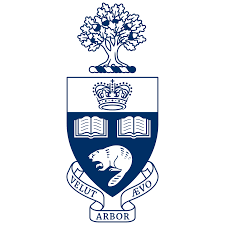

# Hi, I'm Edward
Welcome to my ICS4U portfolio. I’ll use this site to post my work and reflections.

## About me
Hello my name is Edward and I am a student at port credit high school. Im currently in grade 12 and will soon be appling for post secondary.I don't know what job or even what program im going to take after high school. Right now im looking at some programes in UofT, Mc Master, and other Uni's. I am instreased in the sciences and math so maybe, in the future, I will do something relating to that. The website will go over all the major projects I do in ICS4U (com science) class.    

### Highlights
- 🔧 Project 1: *(title)*
- 🧠What is the project?: *(short note)*
- 📝 Blog: [Reflection #1](./posts/first_reflection.md)

Image(s) of project

---
*Update this page by editing `index.md` in your repository.*
